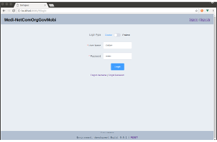
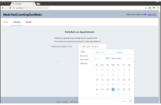
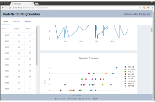

# Medi-NetComOrgGovMobi

> A growing Vue.js project





## Prerequisites

This App requires a newer version of Node be installed. It is recommended you use **8.9.3 LTS (Carbon)** release

```bash
#If you have NVM installed
nvm install 8.9.3
```
## Explain thy self

Most of the files have comments explaining why I chose to do
things one way vs. another or explain what is going on. This app follows the first principle of development as **"Get it working"**. As a result there is a lot of redundancy where other iterations, abstractions or refactoring would help eliminate the many of the D.R.Y. problems. The *vue-resource* (the http client) would benefit from such an abstraction. Doing so makes it easier to swap out one component when it is no longer needed or useful.

### Front End
1. Vue.js
1. Vuex
1. Flexbox
1. ES6
1. Plotly
1. Element UI
1. sass
1. Babel
1. Webpack
1. Other stuff

I chose Vue.js as I have been working with it pretty steadily for a few months on a personal Project. The *vue-cli* basically does the majority of the project setup and it works out of the box.

I didn't fully flush out the Front End in any great detail, just enough to get the point across. I show the data can be input, validated, and submitted. From there, formatting/manipulating is pretty straight forward.

Uses *Vuex* to manage state

The charting functionality (*plotly*) is part of another project with similar functionality so it was easy to integrate. It also is a good representation of reusable components.


### Backend
1. Node
1. Express
1. LocalStorage

Using a seed *data.json* file I build out the LocalStorage (LS) databases. An abstraction library that wraps the LS functionality makes it easier to manage manipulation of that data. This works fine for the demo because it's self contained but this is obviously not recommended as the only solution for use in production. The abstraction makes it easy to swap out or add another data provider.

This is also a semi-restful backend in that you can GET, POST and DELETE data into/out of the datastore. I say semi because it's implemented on the backend but not fully taken advantage of on the front end. Other iterations of this app could take advantage of PUT.

### db
1. json-server

json-server is fully RESTful and could have just as easily been used for data storage instead of or in addition to LocalStorage. The two of together them would make for a highly available application.

This runs the data for the charting

```bash
# Clone repo
cd YOUR_REPO_NAME
```

## Setup

This is running the development build of things so it's slow and noisy, but it gives the best look at the app.

```bash
#In a new terminal install dependencies
npm install
```

## If you have PM2 installed
```bash
#Test for it
pm2 --version

#should return something like
$ 2.9.1
```
```bash
#Spin up the app
npm run demo
```

## Otherwise
```bash
#In a terminal window #1 spin up the JSON server
nvm use 8.9.3 && ./node_modules/json-server/bin/index.js src/data/db.json --fks '_id'
```
```bash
#In a terminal window #2 spin up the Front End
nvm use 8.9.3 && npm run frontend-dev
```
```bash
#In a terminal window #3 spin up the Backend
nvm use 8.9.3 && npm run backend-dev
```


Open your browser to `http://localhost:8080`


## Build Setup

``` bash
# install dependencies
npm install

# serve with hot reload at localhost:8080
npm run dev

# build for production with minification
npm run build

# build for production and view the bundle analyzer report
npm run build --report

# run unit tests
npm run unit

# run e2e tests
npm run e2e

# run all tests
npm test
```

For a detailed explanation on how things work, check out the [guide](http://vuejs-templates.github.io/webpack/) and [docs for vue-loader](http://vuejs.github.io/vue-loader).
